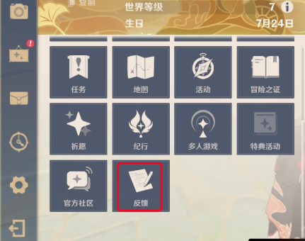
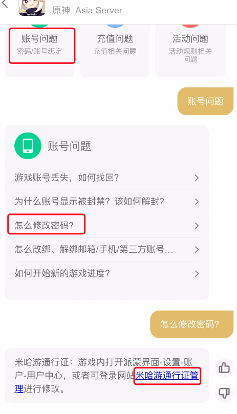
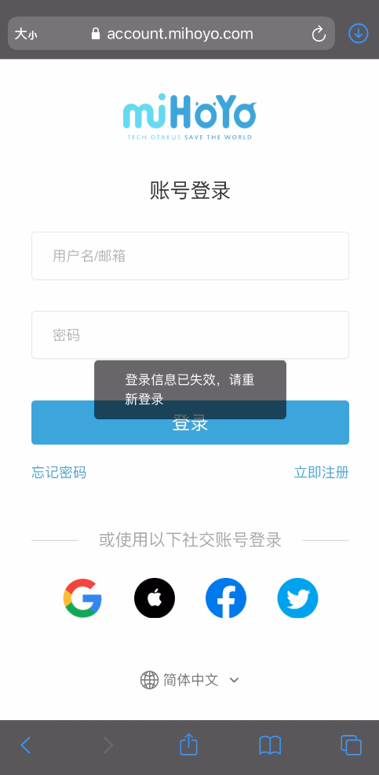
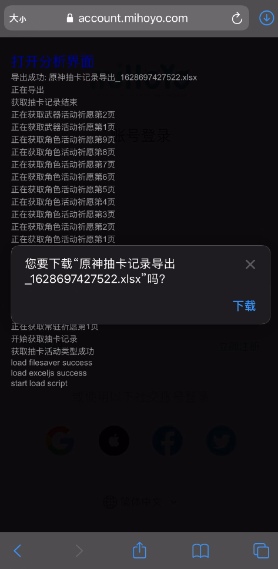

# 原神导出抽卡记录 JS 版

1. 受 [sunfkny](https://github.com/sunfkny/genshin-gacha-export-js) 和 [Velocita](https://github.com/Velocita/genshin-gacha-export-js) 启发，重写一个 JavaScript 版。  
2. 整个流程可以只在手机上直接操作, 无需抓包或者 PC 。  
3. 工具需要获取到 authky，这相当于用户身份信息，目前可以做啥还不清楚，不排除可以重置密码等操作，建议别泄露到其它地方。  
4. 郑重声明：本工具纯本地运行，不会收集任何用户信息。

## 一、保存浏览器书签

1. 书签标题: 原神抽卡导出。  
2. 书签内容:
```
javascript:(function(){const s=document.createElement("script");s.src='https://cdn.jsdelivr.net/gh/hjmmc/genshin-gacha-export-js@main/index.min.js';document.body.append(s)})();
```

## 二、使用方法

1. 首先把上面的内容保存为浏览器书签
2. 然后通过游戏里的反馈打开米哈游通行证页面: 派蒙头像 -> 游戏反馈 -> 账号问题 -> 历史设备临时处理(国服)/怎么修改密码(国际服) -> 米哈游通行证管理
3. 无需登录, 只需在当前页(米哈游通行证管理)打开存好的书签即可。脚本跑完就能得到你的抽卡记录 Excel 表啦
4. 最后把表格上传至 [分析工具](https://genshin-gacha-analyzer.vercel.app/) 即可进行分析

PS: 若无法导出，请尝试更换浏览器，实在不行建议用 PC 上的 Chrome 浏览器打开，或者试试 [NodeJS 版](https://github.com/hjmmc/genshin-gacha-export-nodejs/releases)

## 附上截图






